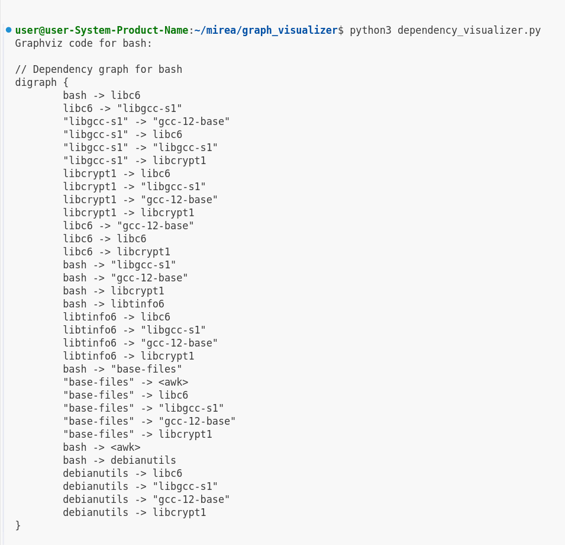

## Graph Visualizer

### Запуск
```python3 dependency_visualizer.py```



### Тестирование
```python3 test_dependency_visualizer.py```


### Получение изображения из output.dot
```dot -Tpng output.dot -o output.png```
 
Результат:


